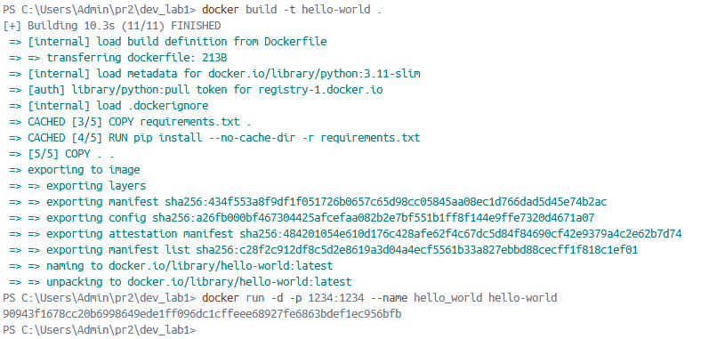
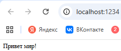
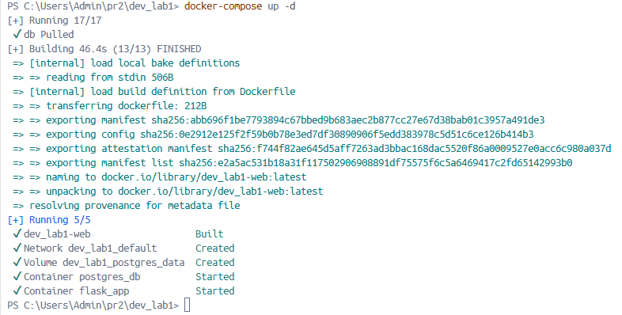
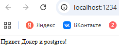

# Docker: создание и управление контейнерами

Ягудин Ильдар Барисович ПИ-431Б

---
1. Изучили теорию, установили docker desktop

2. Создали Dockerfile для нашего приложения 

3. Собрали образ 

4. Запустили для проверки контейнер, проверили, что при обращении по адресу [http://localhost:1234/](http://localhost:1234/) возвращается "Привет мир!" 

5. Написали docker-compose.yml, запустили для проверки.

